# Práctica 6
[](https://coveralls.io/github/ULL-ESIT-INF-DSI-2122/ull-esit-inf-dsi-21-22-prct06-generics-solid-tanafc?branch=master)

## Introducción
En esta practica se propone la resolución de una serie de ejercicios para la comprensión de las clases e interfaces genéricas del lenguaje TypeScript, aplicando los principios SOLID del diseño oritentado a objetos.

## Ejercicios
Todas las soluciones se encuentran alojadas en su carpeta correspondiente dentro del directorio `./src`, mientras que las pruebas de las clases implementadas cuelgan de `./tests`. Se procede a continuación con la realización de las actividades.

### Ejercicio - 1 | El combate definitivo
#### Clase Fighter
A partir del desarrollo de la práctica anterior, se propone implementar una clase abstracta genérica `Fighter`, la cual definirá los atributos y métodos necesarios para que cualquier contendiente pueda luchar. Esta clase se muestra a continuación:
```ts
/**
 * Type that defines the roles of different fighters
 * in different universes.
 */
export type FightingRole = "Beast" | "Mage" | "Warrior"

/**
 * Type that defines the effectiveness of the attacks.
 */
export type Effectivity = "Effective" | "NotEffective" | "Neutral"

/**
 * Abstract class Fighter that defines a set of attributes and methods
 * in common for fighters of different universes.
 */
export abstract class Fighter {
  constructor(protected name: string,
    protected attack: number, protected defense: number,
    protected speed: number, protected hitPoints: number,
    protected weight: number, protected height: number,
    protected role: FightingRole, protected universe: string,
    protected catchingPhrase?: string) {
  }

  public getName(): string {
    return this.name;
  }

  public getAttack(): number {
    return this.attack;
  }

  public getDefense(): number {
    return this.defense;
  }

  public getSpeed(): number {
    return this.speed;
  }

  public getHitPoints(): number {
    return this.hitPoints;
  }

  public setHitPoints(value: number): void {
    this.hitPoints = value;
  }

  public getWeight(): number {
    return this.weight;
  }

  public getHeight(): number {
    return this.height;
  }

  public getUniverse(): string {
    return this.universe;
  }

  public getFightingRole(): FightingRole {
    return this.role;
  }

  /**
   * If defined, returns the catching phrase of the fighter,
   * otherwhise it returns an empty string.
   * @returns the catching phrase of the fighter.
   */
  public getCatchingPhrase(): string {
    if (this.catchingPhrase) {
      return this.catchingPhrase;
    } else {
      return "";
    }
  }

  /**
   * Method to be implemented by child classes that establishes
   * the rules of effectivity in the attacks of the fighters in
   * the same universe.
   * @param opponent opponent to check the effectivity of the attack.
   */
  abstract getEffectivity(opponent: Fighter): Effectivity;
}
```
Se ha definido un tipo `FightingRole`, el cual se asignará a los contendientes de los distintos universos que participarán en los combates. A su vez, el tipo `Effectivity` permitirá identificar el valor de efectividad que los ataques de los contendientes tendrán. 

La clase `Fighter` define los atributos comunes a todos los contrincantes, con sus estadísticas base de `attack`, `defense`, `speed` y `hitPoints`, otros atributos comunes como su peso y altura (`weight` y `height`), el rol del personaje y su universo, y un parámetro opcional `catchingPhrase`, que podrá ser definida para cada personaje y que será representativa del mismo. 

De esta manera, se implementan getters y setters para cada uno de los atributos, así como un método abstracto `getEffectivity`, que deberán implementar las clases hijas y que determinará la efectividad entre los personajes de un mismo universo.

Cada universo extenderá así la clase `Fighter`, implemetando los atributos y métodos necesarios dentro de su propio mundo. La idea es que, para personajes de un mismo universo, el combate entre ellos se lleve a cabo mediante las reglas de efectividad que sus propios universos definan, mientras que, para combatientes de distintos universos, estas reglas se definirán por los roles `FightingRole`, que son asignados a los personajes de un universo. Por ejemplo, y como veremos más adelante, al universo Pokemon se le asignara el rol de `Beast`, mientras que a otros, se le asignara `Warrior` o `Mage`.

A continuación presentaremos los universos que se han definido, siendo cuatro en total.

#### Universo Pokemon
En este universo, los Pokemons son criaturas que se definen mediante sus stats de ataque, defensa, velocidad, vida y tipo. Los tipos definidos serán fuego, agua, electrico, planta y normal. Se observa a continuación la clase `Pokemon`, que extiende a la clase `Fighters` y permite instanciar a las criaturas:
```ts
/**
 * Type that represents the posible types of the Pokemons
 */
export type pokeType = "Fire" | "Water" | "Electric" | "Plant" | "Normal";

/**
 * Class that represents a set of attributes and methods
 * for the Pokemons in the Pokemon universe.
 */
export class Pokemon extends Fighter {
  constructor(name: string, private type: pokeType,
      attack: number, defense: number, speed: number, hitPoints: number,
      weight: number, height: number, private alias?: string, catchingPhrase?: string) {
    super(name, attack, defense, speed, hitPoints, weight, height,
        "Beast", "Pokemon", catchingPhrase);
  }

  /**
   * If defined, returns the alias of the pokemon, otherwhise
   * it returns 'Este pokemon no tiene mote'.
   * @returns a string containing the alias.
   */
  public getAlias(): string {
    if (this.alias) {
      return this.alias;
    }
    return "Este pokemon no tiene un mote";
  }

  public setAlias(name: string) {
    this.alias = name;
  }

  public getType(): pokeType {
    return this.type;
  }

  /**
   * Method that returns the effectivity value of an attack depending
   * on the types that the Pokemons have.
   * @param opponent opponent to check the effectivity with.
   * @returns the effectivity value of an attack.
   */
  public getEffectivity(opponent: Pokemon): Effectivity {
    switch (this.getType()) {
      case "Fire":
        if (opponent.getType() == "Fire" || opponent.getType() == "Water") {
          return "NotEffective";
        } else if (opponent.getType() == "Plant") {
          return "Effective";
        } else {
          return "Neutral";
        }
      case "Water":
        if (opponent.getType() == "Water" || opponent.getType() == "Plant" ||
            opponent.getType() == "Electric") {
          return "NotEffective";
        } else if (opponent.getType() == "Fire") {
          return "Effective";
        } else {
          return "Neutral";
        }
      case "Electric":
        if (opponent.getType() == "Electric") {
          return "NotEffective";
        } else if (opponent.getType() == "Water") {
          return "Effective";
        } else {
          return "Neutral";
        }
      case "Plant":
        if (opponent.getType() == "Plant" || opponent.getType() == "Fire") {
          return "NotEffective";
        } else if (opponent.getType() == "Water") {
          return "Effective";
        } else {
          return "Neutral";
        }
      case "Normal":
        return "Neutral";
    }
  }
}
```
El tipo `pokeType` permitirá diferenciar los tipos de los pokemons. Dentro de la clase, observamos como los pokemons, además de sus estadísticas bases, se les permite asignar un mote, así como su `catchingPhrase` característica, que será distinta para cada criatura. Al llamar a `super`, la clase `Pokemon` se definirá como universo Pokemon, y se le asignará un rol global entre los universos, siendo este el de `Beast`.

Se implementan así los getters y setters de los atributos característicos de los Pokemons, así como el método `getEffectivity`, que debía ser implementado para extender la clase `Fighter`, y el cual retornará el valor de efectividad de los ataques entre los tipos de Pokemons oponentes, siendo similar a la práctica anterior.

Habiendo desarrollado previamente las pruebas para la clase Pokemon, su ejecución confirmará la correcta implementación de la clase:

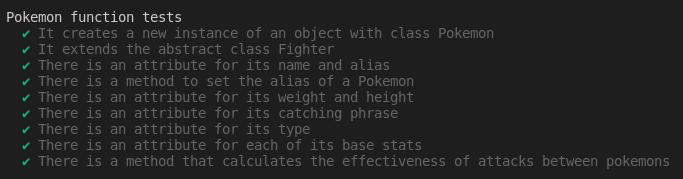

#### Universo Fire Emblems
Los héroes del universo de Fire Emblem también se unirán al combate. Dichos luchadores se distinguirán por su manejo de las armas y monturas, teniendo su propias efectividades y dependiendo de las mismas.

Se observa a continuación la implementación de la clase `FireEmblem`
```ts
/**
 * Type that defines the weapons of the heroes of FE.
 */
type weaponType = "Axe" | "Sword" | "Spear";

/**
 * Class that represents fighters of the universe of Fire Emblem. It
 * defines significant attributes of this world.
 */
export class FireEmblem extends Fighter {
  constructor(hero: string, private weapon: weaponType,
      attack: number, defense: number, speed: number, hitPoints: number,
      weight: number, height: number, private mount: boolean, catchingPhrase?: string) {
    super(hero, mount ? attack * 0.5 : attack, mount ? defense * 2 : defense, mount ? speed * 3 : speed,
        mount ? hitPoints * 2 : hitPoints, weight, height, "Warrior", "FireEmblem", catchingPhrase);
  }

  /**
   * Returns the weapon that the hero uses.
   * @returns the weapon as a string.
   */
  public getWeapon(): weaponType {
    return this.weapon;
  }

  /**
   * Returns true if the unit is mounted.
   * @returns boolean value.
   */
  public isMounted(): boolean {
    return this.mount;
  }

  /**
   * Establishes the effectivity triangle between weapons in the universe,
   * returning the Effectivity value.
   * @param opponent opponent to check the effectivity depending on his weapon.
   * @returns the effectivity value of the attack.
   */
  public getEffectivity(opponent: FireEmblem): Effectivity {
    let typeAdvantage: Effectivity;

    switch (this.getWeapon()) {
      case "Sword":
        if (opponent.getWeapon() == "Spear") {
          typeAdvantage = "NotEffective";
        } else if (opponent.getWeapon() == "Axe") {
          typeAdvantage = "Effective";
        } else {
          typeAdvantage = "Neutral";
        }
        break;

      case "Spear":
        if (opponent.getWeapon() == "Sword") {
          typeAdvantage = "Effective";
        } else if (opponent.getWeapon() == "Axe") {
          typeAdvantage = "NotEffective";
        } else {
          typeAdvantage = "Neutral";
        }
        break;

      case "Axe":
        if (opponent.getWeapon() == "Spear") {
          typeAdvantage = "Effective";
        } else if (opponent.getWeapon() == "Sword") {
          typeAdvantage = "NotEffective";
        } else {
          typeAdvantage = "Neutral";
        }
    }
    return typeAdvantage;
  }
}
```
En primer lugar, los tipos de armas que los personajes usarán será los definidos por `weaponsType`, siendo estos espada, hacha y lanza. El constructor de la clase permitirá definir las estadísticas base, su tipo de arma `weapon`, un booleano `isMounted` que indicará si el personaje usa montura, así como su `catchingPhrase` opcional. Las stats de ataque, defensa y velocidad se verán afectadas dependiendo de si el personaje usa la montura o no. Se observa además como, dentro de `super`, a los luchadores de este universo se les asigna el rol de `Warrior`.

La clase implementa así getters y setters, además del método `getEffectivity`, que retornará el valor de eficacia del ataque dependiendo del tipo de arma que los luchadores de este universo utilicen, siendo las espadas superiores a las hachas, las hachas superiores a las lanzas, y las lanzas superiores a las espadas.

La ejecución de las pruebas implementadas mostrarán el correcto funcionamiento de la clase:

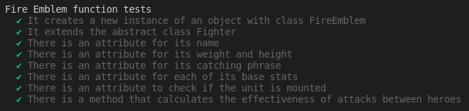

#### Universo League of Legends
Los campeones del League of Legends formarán parte del combate. Para ello, se definirán estadísticas propias de este universo, así como su propio sistema de eficacias.

La implementación de la clase `LeagueOfLegends` es la siguiente:
```ts
/**
 * Class that defines champions of the League of Legends universe.
 * It has a set of attributes significant to the world of Runeterra.
 */
export class LeagueOfLegends extends Fighter {
  constructor(champion: string, private damageAD: number, private damageAP: number,
      private armor: number, private magicResist: number, speed: number, hitPoints: number,
      weight: number, height: number, catchingPhrase?: string) {
    super(champion, damageAD + damageAP, armor + magicResist, speed,
        hitPoints, weight, height, "Mage", "Runaterra", catchingPhrase);
  }

  /**
   * Returns the physical damage the champion deals.
   * @returns the AD damage.
   */
  public getDamageAD(): number {
    return this.damageAD;
  }

  /**
   * Returns the magical damage the champion deals.
   * @returns the AP damage.
   */
  public getDamageAP(): number {
    return this.damageAP;
  }

  /**
   * Returns the physical armor the champion has.
   * @returns the armor stat value.
   */
  public getArmor(): number {
    return this.armor;
  }

  /**
   * Returns the magic resistance the champion has.
   * @returns the magic resist stat value.
   */
  public getMagicResist(): number {
    return this.magicResist;
  }

  /**
   * Method that returns the effectivity of an attack dealt by
   * an opponent depending on the AD, AP, armor and magic resistance
   * stats.
   * @param opponent opponent to check the effectiveness of an attack.
   * @returns the effectivity value of the attack.
   */
  public getEffectivity(opponent: LeagueOfLegends): Effectivity {
    if (this.getDamageAP() > this.getDamageAD()) {
      if (this.getDamageAP() > opponent.getMagicResist()) {
        return "Effective";
      } else {
        return "NotEffective";
      }
    } else if (this.getDamageAP() < this.getDamageAD()) {
      if (this.getDamageAD() > opponent.getArmor()) {
        return "Effective";
      } else {
        return "NotEffective";
      }
    } else {
      return "Neutral";
    }
  }
}
```
Cada campeón en este universo se distingue por sus estadísticas de daño físico, mágico, así como su armadura y resistencia mágica. El ataque del personaje será la suma de sus atributos físicos y mágicos (`damageAD` y `damageAP`), y su defensa la suma de su armadura para el daño físico (`armor`) y su resistencia mágica (`magicResist`). Se observa como los luchadores de este universo serán asignados con el rol de `Mages`.

Así, la clase implementa los getters y setters propios de los atributos, además del método `getEffectivity`, donde el valor de efectividad se verá afectado por el daño físico o mágico del personaje, y la estadística de armadura o resistencia mágica correspondiente al daño. Donde, en el caso de que el daño supere la resistencia del rival, el ataque será efectivo, siendo no efectivo en caso contrario, o neutral si la estadística de ataque físico y mágico del atacante es la misma.

La ejecución de las pruebas mostrará la correcta implementación de la clase:

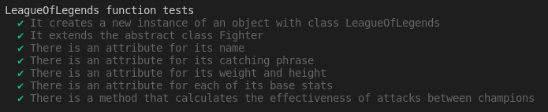

#### Universo Tekken
Por último, los luchadores del universo de Tekken también entrarán en acción. Aquí, cada combatiente tendrá un estilo de lucha marcial propio, que vendrá definido por un tipo `MartialArt`. La clase `Tekken` implementará así los atributos y métodos necesarios para representar a un luchador de este mundo:
```ts
/**
 * Type that defines a set of martial arts.
 */
type MartialArt = "Karate" | "Taekwondo" | "Capoeira" | "Boxing" |
    "Wrestling" | "Muay Thai" | "Mixed";

/**
 * Class that defines fighters of the Tekken universe. It has a set
 * of attributes and methods representative of this world.
 */
export class Tekken extends Fighter {
  constructor(name: string, private nacionality: string, private style: MartialArt,
      private devilGene: number, private rage: number,
      weight: number, height: number, catchingPhrase?: string) {
    super(name, 25 + (devilGene * 2 + rage), 50, 10, 110, weight, height,
        "Warrior", "Tekken", catchingPhrase);
  }

  /**
   * Returns the nacionality of the fighter.
   * @returns the nacionality of the fighter.
   */
  public getNacionality(): string {
    return this.nacionality;
  }

  /**
   * Returns the martial art of the fighter.
   * @returns the type of martial art of the fighter.
   */
  public getMartialArt(): string {
    return this.style;
  }

  /**
   * Returns the value of the devil gene that some
   * fighters of the universe possess.
   * @returns the devil gene stat.
   */
  public getDevilGene(): number {
    return this.devilGene;
  }

  /**
   * Returns the rage stat of the fighter
   * @returns the rage stat value.
   */
  public getRage(): number {
    return this.rage;
  }

  /**
   * Method that returns the effectivity value of an attack depending
   * on the type of martial art that the character practice.
   * @param opponent opponent to check the effectivity with.
   * @returns the effectivity value of an attack.
   */
  public getEffectivity(opponent: Tekken): Effectivity {
    if (this.getMartialArt() == "Taekwondo" || this.getMartialArt() == "Capoeira") {
      if (opponent.getMartialArt() == "Boxing") {
        return "Effective";
      } else if (opponent.getMartialArt() == "Wrestling") {
        return "NotEffective";
      } else {
        return "Neutral";
      }
    } else if ((this.getMartialArt() == "Karate" || this.getMartialArt() == "Muay Thai") &&
        (opponent.getMartialArt() == "Karate" || opponent.getMartialArt() == "Muay Thai")) {
      return "Effective";
    } else {
      return "Neutral";
    }
  }
}
```
De esta manera, los personajes de la clase `Tekken` tendrán un daño base de 25, así como una defensa de 50, velocidad de 10, y vida de 110. El ataque se verá aumentado en caso de que el combatiente posea una cantidad de `devilGene` y `rage`, conceptos propios de la franquicia. Se observa así como los luchadores de este universo serán definidos con el rol de `Warrior`.

La implementación de las eficacias del método `getEffectivity` se realizará en base a las artes marciales que los combatientes de este universo practiquen. Por ejemplo, en el caso del Taekwondo o Capoeira será efectivo contra el Boxing, pero débil contra Wrestling. Los casos de Karate o Muay Thai son especiales, ya que serán efectivos si están en contra de otro oponente que practique este mismo estilo de lucha.

La ejecución de las pruebas mostrará la correcta implementación de la clase:

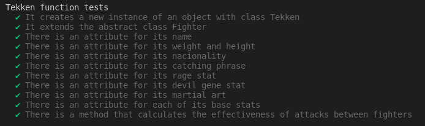

#### Clase Combat
La clase `Combat` permitirá que los combates se disputen entre los contendientes, ya sean estos del mismo universo o de distintos, siendo posible todas las combinaciones. Para ello, se implementarán atributos y métodos para poder simular el combate entre distintos oponentes. 
```ts
/**
 * Class Combat that defines a combat between two oponents.
 * It implements the methods to start the combat and calculate
 * the results.
 */
export class Combat<T extends Fighter, U extends Fighter> {
  constructor(private firstOpponent: T, private secondOpponent: U) {
  }

  public getFirstOpponent(): T {
    return this.firstOpponent;
  }

  public getSecOpponent(): U {
    return this.secondOpponent;
  }

  /**
   * Determinates the effectivity of an attack depending on the
   * advantage that the opponents have in their own universe, or
   * the role that is established in different universes.
   * @param attackOpponent Opponents who attacks.
   * @param defendOpponent Opponent who receives the attack.
   * @returns The effectivity of the attack given as a type Effectivity.
   */
  private effectivityStat(attackOpponent: (T | U), defendOpponent: (T | U)): Effectivity {
    let typeAdvantage: Effectivity = "Neutral";

    if (attackOpponent.getUniverse() == defendOpponent.getUniverse()) {
      typeAdvantage = attackOpponent.getEffectivity(defendOpponent);
    } else {
      switch (attackOpponent.getFightingRole()) {
        case "Beast":
          if (defendOpponent.getFightingRole() == "Warrior") {
            typeAdvantage = "Effective";
          } else if (defendOpponent.getFightingRole() == "Mage") {
            typeAdvantage = "NotEffective";
          } else {
            typeAdvantage = "Neutral";
          }
          break;

        case "Warrior":
          if (defendOpponent.getFightingRole() == "Mage") {
            typeAdvantage = "Effective";
          } else if (defendOpponent.getFightingRole() == "Beast") {
            typeAdvantage = "NotEffective";
          } else {
            typeAdvantage = "Neutral";
          }
          break;

        case "Mage":
          if (defendOpponent.getFightingRole() == "Beast") {
            typeAdvantage = "Effective";
          } else if (defendOpponent.getFightingRole() == "Warrior") {
            typeAdvantage = "NotEffective";
          } else {
            typeAdvantage = "Neutral";
          }
          break;
      }
    }
    return typeAdvantage;
  }

  /**
   * Calculates the damage dealt by the attackOpponent to the defendOpponent,
   * based in the attack and defense stats.
   * @param attackOpponent Opponent who is attacking.
   * @param defendOpponent Oponnent who receives the attack.
   * @returns The damage dealt by the attackOpponent.
   */
  private dmgResult(attackOpponent: (T | U), defendOpponent: (T | U)): number {
    let baseDamage = (50 * (attackOpponent.getAttack() / defendOpponent.getDefense()));
    let typeAdvantage = this.effectivityStat(attackOpponent, defendOpponent);
    let damageMultiplier = 1;

    switch (typeAdvantage) {
      case "Neutral":
        damageMultiplier = 1;
        break;
      case "Effective":
        console.log('Its super effective!');
        damageMultiplier = 2;
        break;
      case "NotEffective":
        console.log('Its not very effective...');
        damageMultiplier = 0.5;
        break;
    }

    let totalDamage = baseDamage * damageMultiplier;
    console.log(`${attackOpponent.getName()} deals ${totalDamage} damage to ${defendOpponent.getName()}!`);

    return totalDamage;
  }

  /**
   * Method that simulates and initiates the battle between the opponents.
   * @returns The winner of the combat, given as a string.
   */
  public start(): string {
    let attackOpponent: (T | U) = this.firstOpponent;
    let defendOpponent: (T | U) = this.secondOpponent;
    let winner: string;

    // Combat simulation
    console.log(`${defendOpponent.getName()} VS ${attackOpponent.getName()}!`);
    console.log(`${attackOpponent.getName()} has ${attackOpponent.getHitPoints()} HP`);
    console.log(`${defendOpponent.getName()} has ${defendOpponent.getHitPoints()} HP`);

    while (true) {
      console.log(`${attackOpponent.getName()} attacks!`);
      console.log(`${attackOpponent.getCatchingPhrase()}`);
      let dmg = this.dmgResult(attackOpponent, defendOpponent);
      defendOpponent.setHitPoints(defendOpponent.getHitPoints() - dmg);
      console.log(`${defendOpponent.getName()} has ${defendOpponent.getHitPoints()} HP left`);

      if (defendOpponent.getHitPoints() <= 0) {
        console.log(`${defendOpponent.getName()} can't battle anymore, ${attackOpponent.getName()} is the winner!`);
        winner = attackOpponent.getName();
        break;
      } else {
        let aux: (T | U) = defendOpponent;
        defendOpponent = attackOpponent;
        attackOpponent = aux;
      }
    }
    return winner;
  }
}
```
La clase `Combat` implementa así dos atributos de tipo genérico con la forma de tipo de la clase `Fighter`, que representará a ambos oponentes, `firstOpponent` y `secondOpponent`, con sus getter correspondientes. 

El método `effectivityStat` será el encarcado de, dados dos oponentes, comprobar el universo del que provienen y en el caso de ser del mismo universo, aplicar las reglas de efectividad de su propio universo o, por el contrario, aplicar las reglas de efectividad de los __roles__ asignados a cada universo `FightingRole`. Esto es, las bestias `Beast` serán efectivas contra los guerreros `Warriors`, los guerreros serán efectivos contra los magos `Mages`, y los magos serán efectivos contra las bestias. De esta manera, el método devolverá el valor de efectividad del ataque entre los oponentes, habiéndose estimado mediante las reglas del mismo universo o de distintos. 

Este método será auxiliar a `dmgResult`, que será el método que calculará y devolverá el daño total del ataque realizado entre los oponentes, basado en la fórmula `(50 * (ataque / defensa) * efectividad)`. Se observa como el tipo con el que se llama a los argumentos de ambas funciones es la unión `(T | U)`, que realmente corresponde con la forma del tipo de la clase `Fighter` para ambos oponentes.

Por último, el método `start` será el encargado de comenzar la simulación del combate, donde se establecerán los turnos del combate y se mostrará por pantalla el avance del mismo. La función utilizará el daño calculado por `dmgResult` para restar puntos de vida al oponente. Los roles de atacante y oponente se irán alternando en cada turno, hasta que para alguno de los contrincantes su vida alcance 0. Se retornará así el vencedor `winner` con el nombre del luchador.

Si ejecutamos las pruebas, observaremos como la implementación de la clase `Combat` es correcta, además de mostrarse algunas trazas con el combate de algunos luchadores de distintos universos:

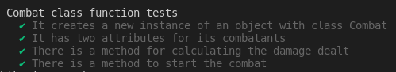

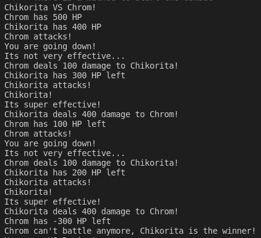
>> Chikorita pertenece al universo Pokemon, mientras que Chrom pertenece a Fire Emblem. Como los personajes de Fire Emblem se establecen con un rol de `Warrior`, los Pokemons al ser `Beast` obtienen la ventaja.

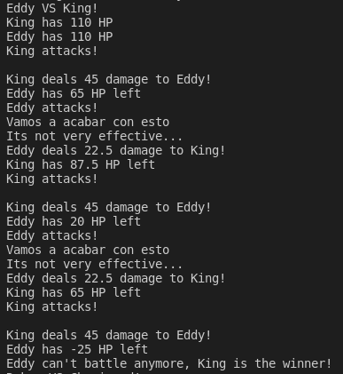
>> El combate entre dos personajes del mismo universo se llevará a cabo mediante las reglas de eficacia de ese universo. En este caso, en el universo de Tekken, Eddy practica Capoeira, lo cual no es efectivo contra King, campeón de Wrestling.

#### Clase Pokedex
Por último, se implementa una clase `Pokedex`, que ahora almacenará la información relativa a todos los luchadores de distintos universos. Para ello, se empleará un tipo `entryFighter`, que contendrá tanto el nombre, estadísticas base, rol dentro del universo y el nombre del universo al que pertenece.
```ts
/**
 * Stores an entry with the information related to a Fighter
 */
type entryFighter = [name: string, attack: number, defense: number,
    speed: number, hitPoints: number, weight: number, height: number,
    role: FightingRole, universe: string];
```

De esta manera, la clase `Pokedex` almacenará una colección de entradas de los luchadores, implementando métodos para el añadido o borrado de entradas de los mismos:
```ts
/**
 * Class Pokedex that stores the entries with information about Fighters
 */
export class Pokedex {
  public entries: entryFighter[] = [];

  constructor(...entries: entryFighter[]) {
    entries.forEach((entry) => {
      this.entries.push(entry);
    });
  }

  /**
   * Given certain Fighters, stores the information related to them as an entry.
   * @param fighter Fighters whose entries want to be added.
   */
  public storeFighters(...fighters: Fighter[]): void {
    fighters.forEach((fighter) => {
      this.entries.push([fighter.getName(), fighter.getAttack(), fighter.getDefense(),
        fighter.getSpeed(), fighter.getHitPoints(), fighter.getWeight(), fighter.getHeight(),
        fighter.getFightingRole(), fighter.getUniverse()]);
    });
  }

  /**
   * Given certain names of Figthers, if the Fighter has an entry,
   * said entry is deleted from the Pokedex.
   * @param fighters Names of the Fighters whose entries want to be deleted.
   */
  public deleteFighters(...fighters: string[]): void {
    fighters.forEach((fighter) => {
      this.entries.forEach((entry, index) => {
        if (entry[0] == fighter) {
          this.entries.splice(index, 1);
        }
      });
    });
  }
}
```
La pokedex se puede instanciar con algunas entradas ya establecidas en el constructor gracias al parámetro `...rest`. El método `storeFighters` permitirá, dado un número indefinido de luchadores, almacenar la información relativa a los mismos como entradas de la pokedex gracias a `forEach` y `push`. Por el contrario, el método `deleteFighters` borrará las entradas de la pokedex de los luchadores cuyos nombre coincidan con alguno proporcionado en el argumento del mismo, eliminando el elemento del array gracias al método `splice`.

La ejecución de las pruebas mostrará la correcta implementación de la clase `Pokedex`:

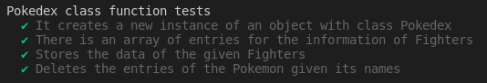

### Ejercicio - 2 | DSIflix
Se plantea el diseño de un modelo de datos de una plataforma de vídeo streaming, a la que se pueden acceder a películas, series y documentales. Para ello, se debe definir una interfaz genérica `Streamable`, que especificará las propiedades y métodos que debería contar una colección de emisiones. Dicha interfaz se implementa a continuación:
```ts
/**
 * Interface that describes a set of methods
 * for a collection of media
 */
export interface Streamable<T>{
  addMedia(media: T): void;
  deleteMedia(name: string): void;
  getMediaAt(index: number): T;
  getNumberStreams(): number;
}

/**
 * Interface that describes a set of methods for
 * searching in a collection of media
 */
export interface SearchableStreamCollection<T> {
  searchNameMedia(name: string): T[];
  searchYearMedia(year: number): T[];
}

/**
 * Interface that defines a method for
 * printing a collection of media
 */
export interface PrintableStreamCollection<T> {
  print(): void;
}
```
Para cumplir con los principios SOLID, la interfaz `Streamable` ha sido dividida en 3 interfaces genéricas. La interfaz `Streamable` definirá los métodos básicos que debe tener la colección de vídeo en streaming, como lo son añadir a la colección `addMedia`, eliminar de la misma `deleteMedia`, tomar un elemento de la selección de streaming `getMediaAt`, y obtener el número de vídeos streaming en el catálogo `getNumberStreams`.

En cambio, la interfaz `SearchableStreamCollection` definirá los métodos necesarios para poder buscar en una colección de streaming, ya sea por el nombre `searchNameMedia`, o el año `searchYearMedia`. Por último, la interfaz `PrintableStreamCollection` definirá un método `print` para poder imprimir toda la colección de streaming.

Todas las interfaces tienen un tipo genérico `T`, el cual podrá ser especificado por las clases que implementen dichas interfaces, ya sean colecciones de series, películas o documentales.

#### Clase BasicStreamableCollection
Una clase abstracta genérica `BasicStreamableCollection` implementará las tres interfaces previamente definidas, particularizando el tipo `T` como una forma de tipo con atributos `name` y `year`. Esto se debe a que, tanto el nombre como el año son atributos comunes a todo tipo de elementos en una colección de streaming. Además, implementará algunos métodos definidos en las interfaces genéricas, dejando el método `print` como abstracto para ser definido por las clases hijas.
```ts
/**
 * Abstract class that implements methods for a collection of media,
 * it implements the interfaces Searchable and Printable for the collection.
 */
export abstract class BasicStreamableCollection<T extends {name: string, year: number}> implements
    Streamable<T>, SearchableStreamCollection<T>, PrintableStreamCollection<T> {
  constructor(protected collection: T[]) {
  }

  /**
   * Getter for the collection
   * @returns the collection
   */
  public getCollection(): T[] {
    return this.collection;
  }

  /**
   * Returns the media in the given index of the collection
   * @param index index in the collection
   * @returns the specified media
   */
  public getMediaAt(index: number): T {
    return this.collection[index];
  }

  /**
   * Returns the number of elements in the collection
   * @returns number
   */
  public getNumberStreams(): number {
    return this.collection.length;
  }

  /**
   * Adds the given media to the collection
   * @param media to be inserted in the collection
   */
  public addMedia(media: T): void {
    this.collection.push(media);
  }

  /**
   * Deletes the element in the collection given the name of a media
   * @param name string containing the name of the media to be deleted
   */
  public deleteMedia(name: string): void {
    this.collection.forEach((media, index) => {
      if (media.name == name) {
        this.collection.splice(index, 1);
      }
    });
  }

  /**
   * Returns an array of elements whose names includes the string given
   * @param name name of the media to search
   * @returns an array containing the matches of the search
   */
  public searchNameMedia(name: string): T[] {
    return this.collection.filter((media) => media.name.includes(name));
  }

  /**
   * Returns an array containing media whose year match the one given
   * @param year number to compare the year of the media
   * @returns an array containing the matches of the search
   */
  public searchYearMedia(year: number): T[] {
    return this.collection.filter((media) => media.year === year);
  }

  /**
   * Method to be implemented by child classes
   */
  abstract print(): void;
}
```

Se observa como la clase a implementado los métodos `addMedia`, que introduce un elemento `T` dentro de la colección, `deleteMedia`, que borra de la colección el elemento cuyo nombre coincida con el proporcionado en el argumento, y los métodos correspondientes a la búsqueda dentro de la colección, `searchNameMedia` y `searchYearMedia` gracias a la función `filter`. Sabemos que los elementos de la colección tienen atributos de nombre y año gracias a que hemos especificado la forma del tipo `T` para que lo tengan. Además, se implementan getters para la colección, así como `getMediaAt` para tomar un elemento de la misma y `getNumberStreams` para el número de elementos.

Las clases que extenderán la clase `BasicStreamableCollection` modelarán cada uno de los tres tipos de colecciones, series, películas y documentales, cada uno representado por su propia clase.

#### Películas
Las películas se particulazarán por tener una serie de géneros, definidos en el tipo `Genre`. Con ello, una clase `Movie` establecerá los atributos que toda película deberá tener, siendo esto su nombre, año, director, género y duración:
```ts
/**
 * Type to describe the genres of movies
 */
type Genre = "Drama" | "Comedy" | "Horror" | "Action";

/**
 * Class that implements the attributes to represent a movie
 */
export class Movie {
  constructor(public name: string, public year: number,
      public director: string, public genre: Genre, public duration: number) {
  }
}
```

La clase `MovieStreamable` extenderá la clase abstracta `BasicStreamableCollection` para definir una colección de películas de streaming:
```ts
/**
 * Class that describes a collection of movies
 */
export class MovieStreamable extends BasicStreamableCollection<Movie> {
  constructor(collection: Movie[]) {
    super(collection);
  }

  /**
   * Prints the collection of movies with each attribute
   */
  public print() {
    this.collection.forEach((movie) => {
      process.stdout.write(`Movie: ${movie.name}, Year: ${movie.year}, Duration: ${movie.duration}, `);
      process.stdout.write(`Director: ${movie.director}, Genre: ${movie.genre}\n`);
    });
  }
}
```
De esta manera, `MovieStreamable` modela el tipo de datos a la clase `Movie`, e implementará el método `print` definido como abstracto en la clase `BasicStreamableCollection`, imprimiendo la información relativa a la colección de películas de streaming.

#### Series
Las series tendrán los mismos géneros que las películas, pero se diferenciarán de estas al tener un número de temporadas. Así, definimos una clase `Series`:
```ts
/**
 * Class Serie that implements a set of attributes for a serie
 */
export class Serie {
  constructor(public name: string, public year: number,
      public director: string, public genre: Genre, public seasons: number) {
  }
}
```

La clase `SeriesStreamable` extenderá a la clase abstracta `BasicStreamableCollection` para definir una colección de series en streaming:
```ts
/**
 * Class that describes a collection of series
 */
export class SeriesStreamable extends BasicStreamableCollection<Serie> {
  constructor(collection: Serie[]) {
    super(collection);
  }

  /**
   * Prints the collection of series with each attribute
   */
  public print() {
    this.collection.forEach((serie) => {
      process.stdout.write(`Serie: ${serie.name}, Year: ${serie.year}, Seasons: ${serie.seasons}, `);
      process.stdout.write(`Director: ${serie.director}, Genre: ${serie.genre}\n`);
    });
  }
}
```
Al igual que en el caso de la clase `MovieStreamable`, `SeriesStreamable` modelará el tipo de datos a la clase `Series`, e implementará el método `print` para imprimir la colección de series de streaming.

#### Documentales
Por último, una clase `Documental` almacenará los atributos correspondientes a un documental. En este caso, el tipo del documental será distinto, distinguiendo entre documentales de naturaleza, ciencia o históricos, definidos en un tipo `TypeDocumental`.
```ts
/**
 * Type that describes types of documentaries
 */
type TypeDocumental = "Historic" | "Science" | "Nature" ;

/**
 * Class that implements attributes for a Documental
 */
export class Documental {
  constructor(public name: string, public year: number,
      public director: string, public type: TypeDocumental, public duration: number) {
  }
}
```

La clase `DocumentalStreamable` definirá una colección de documentales, extenderextendiendo a a la clase `BasicStreamableCollection`, y modelando su tipo de datos como uno de la clase `Documental`. La clase implementará además el método `print` para poder imprimir la colección de documentales.
```ts
/**
 * Class that describes a collection of documentaries
 */
export class DocumentalStreamable extends BasicStreamableCollection<Documental> {
  constructor(collection: Documental[]) {
    super(collection);
  }

  /**
   * Prints the collection of documentaries with each attribute
   */
  public print() {
    this.collection.forEach((documental) => {
      process.stdout.write(`Documental: ${documental.name}, Year: ${documental.year}, Duration: ${documental.duration}, `);
      process.stdout.write(`Director: ${documental.director}, Type: ${documental.type}\n`);
    });
  }
}
```

De esta manera, se implementarían las tres subclases con los tres tipos de colecciones de streaming: series, películas y documentales. Ejecutando las pruebas del código, se comprobará la correcta implementación de las clases:

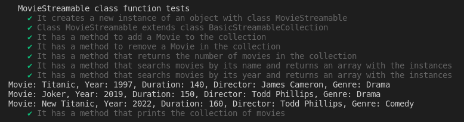

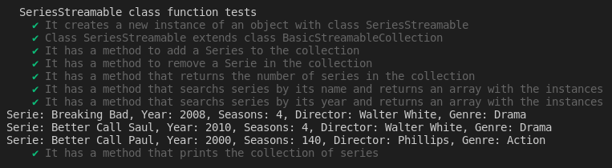

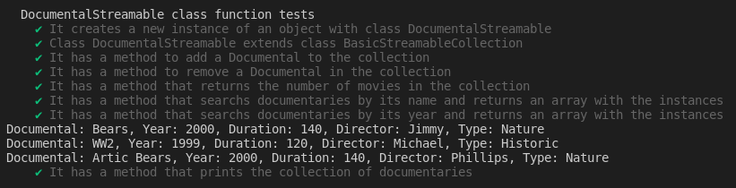


### Ejercicio - 3 | El cifrado indescifrable
Se propone la implementación de una clase `Cifrado`, la cual proporcione los mecanismos para codificar y decodificar un mensaje ante un alfabeto y palabra clave arbitrarios.

Para el desarrollo de la clase, y tratar de aplicar los principios SOLID en el diseño, `Cifrado` será una clase abstracta, encargada de definir los atributos para especificar una clave `key` y alfabeto específicos `alphabet`, así como los métodos necesarios que deberán implementar los cifrados para codificar y decodificar un mensaje dado. De esta manera, la implementación de la misma es la siguiente:
```ts
/**
 * Abstract class that defines a set of attributes and methods
 * to implement in a cipher of any type
 */
export abstract class Cifrado {
  protected key: string = "";
  protected alphabet: string[] = [];

  constructor(key = "", alphabet: string = "") {
    this.key = key;
    if (alphabet !== "") {
      alphabet = alphabet.replace(/ /g, '');
      this.alphabet = alphabet.split(',');
    }
  }

  /**
   * Returns the defined key of the cipher
   * @returns as a string
   */
  public getKey(): string {
    return this.key;
  }

  /**
   * Given a certain key, sets the key of the cipher
   * @param key string to set as key
   */
  public setKey(key: string): void {
    this.key = key;
  }

  /**
   * Returns the alphabet of the cipher as an array of strings
   * @returns the alphabet of the cipher
   */
  public getAlphabet(): string[] {
    return this.alphabet;
  }

  /**
   * Given a string of characters separated by ',',
   * sets the alphabet of the cipher
   * @param alphabet given as a string of characters separated by ','
   */
  public setAlphabet(alphabet: string): void {
    if (alphabet !== "") {
      alphabet = alphabet.replace(/ /g, '');
      this.alphabet = alphabet.split(',');
    }
  }

  /**
   * Starts the cipher of the given message.
   * Method to be implemented by child classes
   * @param plainMessage message to be encoded
   */
  abstract startCipher(plainMessage: string): string;

  /**
   * Starts the decipher of the given message.
   * Method to be implemented by child classes
   * @param encodedMessage message to be decoded
   */
  abstract startDecipher(encodedMessage: string): string;
}
```
De esta manera, cualquier cifrado específico que herede de `Cifrado` deberá tener tanto una clave `key`, como un alfabeto `alphabet`. La clase abstracta implementa así los getters y setters de cada atributo, teniendo especial cuidado con el alfabeto, que deberá ser pasado como una cadena con los caracteres del mismo separados por comas `A, B, C, D...`, para luego ser almacenado en un array de strings donde cada elemento será un carácter, gracias al método `split`. La clase definirá los métodos abstractos `startCipher` y `startDecipher` para que las clases que hereden de la misma implementen los métodos para codificar y decodificar un mensaje.

Así, una clase hija `CifradoCesar` heredará de la clase `Cifrado`, y se encargará de implementar los métodos de cifrado y descifrado característicos del cifrado César.
```ts
export class CifradoCesar extends Cifrado {
  constructor(key: string = "", alphabet: string = "") {
    super(key, alphabet);
  }

  /**
   * Starts the encode of the given message, returning the cipher
   * @param plainMessage message to be encoded
   * @returns the encoded message
   */
  public startCipher(plainMessage: string): string {
    if (this.key === "" || this.alphabet.length === 0 || plainMessage === "") {
      return "Cypher cannot start unless given a key, alphabet and message";
    }

    let seed = this.key;
    while (seed.length < plainMessage.length) {
      seed += seed;
    }

    let cypherMessage = "";
    for (let i = 0; i < plainMessage.length; i++) {
      let textChar = plainMessage.charAt(i);
      let d = 0;
      for (let j = 0; j < this.alphabet.length; j++) {
        if (seed.charAt(i) === this.alphabet[j]) {
          d = j + 1;
          break;
        }
      }
      let cyphered = false;
      for (let j = 0; j < this.alphabet.length; j++) {
        if (textChar === this.alphabet[j]) {
          cypherMessage += this.alphabet[(j + d) % this.alphabet.length];
          cyphered = true;
          break;
        }
      }
      if (!cyphered) {
        cypherMessage += textChar;
      }
    }
    return cypherMessage;
  }

  /**
   * Starts the decode of the given encoded message, returning said message
   * @param encodedMessage encoded message to decode
   * @returns the decoded message
   */
  public startDecipher(encodedMessage: string): string {
    if (this.key === "" || this.alphabet.length === 0 || encodedMessage === "") {
      return "Decypher cannot start unless given a key, alphabet and message";
    }

    let seed = this.key;
    while (seed.length < encodedMessage.length) {
      seed += seed;
    }

    let plainMessage = "";
    for (let i = 0; i < encodedMessage.length; i++) {
      let textChar = encodedMessage.charAt(i);
      let d = 0;
      for (let j = 0; j < this.alphabet.length; j++) {
        if (seed.charAt(i) === this.alphabet[j]) {
          d = j + 1;
          break;
        }
      }
      let decoded = false;
      for (let j = 0; j < this.alphabet.length; j++) {
        if (textChar === this.alphabet[j]) {
          let diff = j - d;
          if (diff >= 0) {
            plainMessage += this.alphabet[diff];
          } else {
            plainMessage += this.alphabet[this.alphabet.length + diff];
          }
          decoded = true;
          break;
        }
      }
      if (!decoded) {
        plainMessage += textChar;
      }
    }
    return plainMessage;
  }
}
```
Para que el cifrado o descifrado puedan realizarse, los métodos se encargarán previamente de comprobar si la clave, el alfabeto, y el mensaje pasado por argumento están definidos, devolviendo la cadena "Cipher | Decipher cannot start unless given a key, alphabet and message" en caso contrario. 

Una vez comprobado, se inicializa una `seed`, la cual será la clave `key` repetida tantas veces como largo sea el mensaje a cifrar o descifrar. De esta manera, se procede a realizar la operación de desplazamiento, donde en el caso de `startCipher` se irán almacenando los caracteres del cifrado en `cypherMessage`. Dentro de un primer bucle, para cada carácter del texto `textChar` se determina la posición correspondiente del carácter de la semilla `seed` dentro del alfabeto definido. De esta manera, se calculará un desplazamiento `d = j + 1`, que será utilizado para cifrar el carácter del texto dentro de un segundo bucle, desplazando la posición `j` del carácter dentro del array del alfabeto un número de posiciones `d`, y almacenando el carácter cifrado correspondiente en el resultado `cypherMessage`. Hay que tener especial cuidado a la hora de intentar acceder a índices más allá del array del alfabeto, por lo que se aplica la operación módulo con la longitud del array para estos casos.

```ts
(...)
      if (!cyphered) {
        cypherMessage += textChar;
      }
```
Gracias a la comprobación de la variable de tipo booleano `cyphered`, se determinará si se ha sido capaz de encontrar el carácter del texto en el alfabeto, siendo en caso contrario el propio carácter el que se codificará en el resultado. De esta manera la función retornará una cadena con el mensaje cifrado.

En el caso de la decodificación en `startDecipher`, el cambio más significativo lo tiene el desplazamiento, que se realizará de manera inversa. En este caso, se restará el índice dentro del alfabeto, hacia la izquierda, y por lo tanto, hay que tener cuidado de acceder a índices negativos. Para solventar esto, si la diferencia `diff` ha resultado ser negativa, se le sumará a la longitud del array, dando el índice correcto en el alfabeto y pudiendo descifrar el carácter de manera correcta.

La ejecución de las pruebas mostrará la correcta implementación del cifrado César:

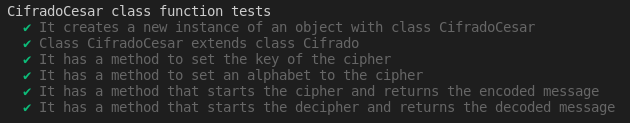

### Conclusión
Se completarían así todos los ejercicios propuestos de esta práctica. En cada caso, se ha intentado tener en cuenta en todo momento los principios SOLID de la programación orientada a objetos, respetando sobre todo el principio de responsabilidad única de clases y de segregación en las interfaces para el diseño de cada ejercicio.

Con todo ello, pienso que esta práctica ha resultado muy útil para comprender el funcionamiento de las clases e interfaces genéricas del lenguaje TypeScript, así como para determinar en qué momentos su implementación sería adecuada. Además, los principios SOLID me han permitido llevar un desarrollo más organizado, y han facilitado el diseño de pruebas en la metodología TDD llevada a cabo.
